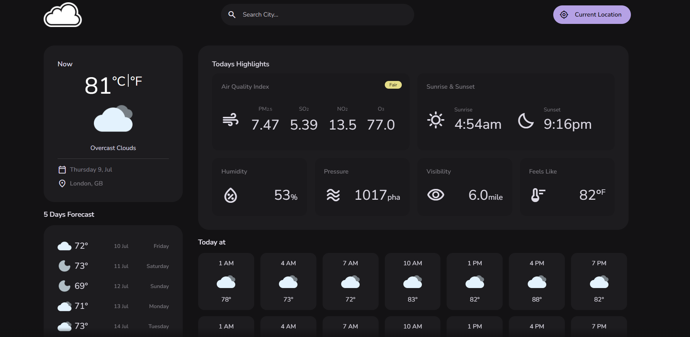

# WeatherDisclose App

<!-- Add Badges here -->




Welcome to the **WeatherDisclose App**! This project is a responsive, feature-rich weather application that provides real-time weather updates, multi-day forecasts, and air quality information.

**<a href="https://weatherdisclose-by-asad-jamil.netlify.app/" target="_blank">🚀 View Live Demo</a>**

## 🌟 Overview

I built this project to create a seamless user experience for checking current weather conditions and air pollution details across different locations. It utilizes open weather APIs and geolocation to deliver accurate and up-to-date information right at your fingertips.

## 📸 Screenshots & Previews

<!-- Add your actual screenshots or GIFs here -->
*Include a GIF demonstrating the weather search and unit toggling here to immediately grab attention.*

| Current Weather | Location Search |
| :---: | :---: |
|  |  |

## 🚀 Key Features

- **Real-Time Weather Data**: Get precise and up-to-date weather conditions for your current location.
- **Location Search**: Look up weather details and forecasts for any city around the world.
- **Air Quality Index**: View detailed air pollution data to stay aware of environmental health.
- **Multi-Day Forecasts**: Plan ahead with accurate hourly and 5-day forecasts.
- **Unit Toggle**: Easily switch between Celsius (Metric) and Fahrenheit (Imperial) units.

## 🛠️ Tech Stack

- **Framework**: <a href="https://react.dev/" target="_blank">React 18</a> + <a href="https://vitejs.dev/" target="_blank">Vite</a>
- **Styling**: Vanilla CSS3
- **Utilities**: <a href="https://rxjs.dev/" target="_blank">RxJS</a>

## 📂 Getting Started

### Prerequisites

Make sure you have Node.js installed on your machine.

### Installation

1. Clone the repository:
   ```bash
   git clone https://github.com/AsadBulediReal/WeatherDisclose.git
   ```
2. Navigate to the project directory:
   ```bash
   cd WeatherDisclose
   ```
3. Install the dependencies:
   ```bash
   npm install
   ```

### Running Locally

```bash
npm run dev
```
The app will be available at `http://localhost:5173`.

## 📬 Contact

Created by **<a href="https://github.com/AsadBulediReal" target="_blank">Asad Jamil Buledi</a>** - feel free to reach out!
- LinkedIn: <a href="https://www.linkedin.com/in/asad-jamil-buledi" target="_blank">Asad Jamil Buledi</a>
- GitHub: <a href="https://github.com/AsadBulediReal" target="_blank">AsadBulediReal</a>
- Email: <a href="mailto:bulediasadjamil@gmail.com" target="_blank">bulediasadjamil@gmail.com</a>
